## 消除推荐系统中流行偏见的模型无关的反事实推理

### 摘要

推荐系统的一般目的是向用户提供个性化的建议，而不是建议流行的项目。然而，正常的训练范式，即拟合推荐模型以恢复具有逐点或成对损失的用户行为数据，使模型偏向于流行项目。这导致了可怕的马太效应，使热门商品被更频繁地推荐，甚至变得更受欢迎。现有的工作通过反向倾向加权（IPW）来解决这个问题，它减少了流行项目对训练的影响，并增加了长尾项目的影响。尽管理论上是合理的，但IPW方法对加权策略非常敏感，这是出了名的难以调整。

在这项工作中，我们从一个新颖而基本的视角——因果关系——来探讨流行偏见问题。我们发现，流行度偏差在于项目节点对排名分数的直接影响，因此项目的内在属性是错误地为其分配更高排名分数的原因。为了消除流行偏见，回答一个反事实的问题是至关重要的，即如果模型只使用项目属性，排名分数会是多少。为此，我们制定了一个因果图来描述推荐过程中的重要因果关系。在培训过程中，我们进行多任务学习，以实现每一项事业的贡献；在测试过程中，我们进行反事实推理，以消除项目受欢迎程度的影响。值得注意的是，我们的解决方案修改了推荐的学习过程，该过程对各种模型都是不可知的——它可以很容易地在现有方法中实现。我们在矩阵分解（MF）和LightGCN[20]上进行了演示，这两个模型代表了用于协同过滤的传统和SOTA模型。在五个真实世界数据集上的实验证明了我们方法的有效性。

### CCS概念

- 信息系统→ 推荐系统。

### 关键字

推荐、流行偏见、因果推理

 图1：推荐系统中受欢迎程度偏差的说明。根据训练集中的受欢迎程度将项目组织成组，其中背景直方图指示每组中项目的比例，纵轴表示平均推荐频率。

ACM引文格式：

Tianxin Wei1 , Fuli Feng2∗, Jiawei Chen1 , Ziwei Wu1 , Jinfeng Yi3 and Xiangnan He1∗. 2021. Model-Agnostic Counterfactual Reasoning for Eliminating Popularity Bias in Recommender System. In *Proceedings of the 27th ACM SIGKDD Conference on Knowledge Discovery and Data Mining (KDD ’21),* *August 14–18, 2021, Virtual Event, Singapore.* ACM, New York, NY, USA, 10 pages. https://doi.org/10.1145/3447548.3467289

### 1. 简介

个性化推荐已经彻底改变了无数的在线应用程序，如电子商务[52，55，60]、搜索引擎[43]和会话系统[29，45]。已经开发了大量的推荐模型[19，26，49]，默认的优化选择是重建历史用户-项目交互。然而，商品的频率分布甚至从未出现在互动数据中，这受到许多因素的影响，如曝光机制、口碑效应、销售活动、商品质量等。在大多数情况下，频率分布是长尾的，即大多数互动被少数热门商品占据。这使得经典的训练范式偏向于推荐热门项目，无法揭示用户的真实偏好[2]。

真实世界的推荐系统通常使用实时用户交互进行持续训练和更新，训练数据和测试数据不是独立和同分布的（非IID）[11，58]。图1提供了真实世界Adressa数据集[18]上流行度偏差的证据，在该数据集中，我们训练标准MF和LightGCN[20]，并计算顶部项目的频率-𝐾 所有用户的推荐列表。蓝线显示了真实的非IID测试数据集的项目频率，这正是我们所期望的。可以看出，训练数据中更受欢迎的项目被推荐的频率远高于预期，这表明存在严重的受欢迎程度偏差。因此，模型倾向于简单地从项目的受欢迎程度来推荐项目，而不是用户项目匹配。这种现象是由训练范式引起的，该范式认为更频繁地推荐流行项目可以实现更低的损失，从而朝着这个方向更新参数。不幸的是，这种流行偏见会阻碍推荐者准确理解用户偏好，并降低推荐的多样性。更糟糕的是，流行偏见会导致马太效应[36]——流行商品被推荐得更多，甚至变得更受欢迎。

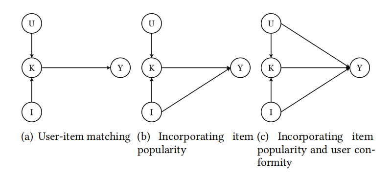 图2：（a）用户项目匹配的因果图；（b） 融入物品流行度；以及（c）结合用户一致性。I： 项目。U： 用户。K： 用户和项目之间的匹配功能。Y： 排名得分（例如交互的概率）。

为了解决正常训练范式的问题，一系列研究推动推荐者训练强调长尾项目[7，31]。其想法是降低流行项目对推荐人训练的影响，例如，在训练损失中重新加权它们的交互[30，50]，合并平衡的训练数据[7]或解开用户和项目嵌入[58]。然而，这些方法缺乏对物品流行度如何影响每一次特定互动的精细考虑，也缺乏对流行度偏见机制的系统观点。例如，流行项目上的交互总是比长尾项目权重低，而不管哪个流行项目更符合用户的偏好。我们认为，消除流行偏见的关键不是盲目地将推荐者推到长尾，而是了解物品流行如何影响每次互动。

为此，我们从一个基本的角度——因果关系——来探讨流行偏见，这在推荐系统中很少受到审查。我们首先建立了一个因果图（图2（c））来描述推荐过程中的重要因果关系，这与历史互动的生成过程相对应。在我们看来，影响互动概率的主要因素有三个：用户-项目匹配、项目受欢迎程度和用户一致性。然而，现有的推荐模型主要关注用户-项目匹配因素[22，53]（图2（a）），忽略了项目受欢迎程度如何影响交互概率（图2的（b））。假设两个项目对一个用户具有相同的匹配度，那么受欢迎程度更高的项目更有可能被用户知道，从而被消费。此外，物品受欢迎程度的这种影响可能因不同用户而异，例如，一些用户更有可能探索受欢迎的物品，而有些用户则不然。因此，我们进一步添加了来自用户节点的直接边缘（$U$）到排名分数（$Y$）以构成最终的因果图（图2（c））。为了有效地消除流行偏见，从项目节点推断直接影响是至关重要的（$I$）到排名分数（$Y$），以便在推荐推断期间将其移除。

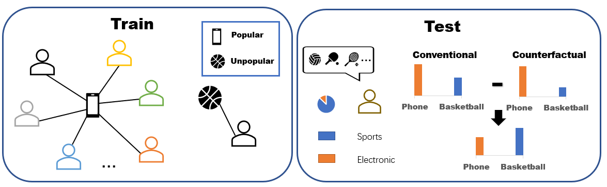 图3：反事实推理的一个例子。

为此，我们求助于因果推断，这是一门分析因果关系的科学[35]。根据反事实推理理论[35] $I\rightarrow Y$ 可以通过想象一个用户项目匹配被丢弃并且交互是由项目流行度和用户一致性引起的世界来估计。为了进行流行度去偏，我们只需从总体排名得分中扣除反事实世界中的排名得分。图3显示了一个玩具示例，其中训练数据偏向iPhone，使iPhone上的模型得分更高，尽管用户对篮球更感兴趣。在推理阶段，通过扣除反事实预测来消除这种偏差。

在我们的方法中，为了更好地学习用户项目匹配，我们构造了两个辅助任务来捕捉 $U\rightarrow Y$ 和 $I\rightarrow Y$ . 该模型在主要任务和两个辅助任务上进行联合训练。值得注意的是，我们的方法是模型不可知的，我们在MF[28]和LightGCN[20]上实现了它，以证明其有效性。总之，这项工作做出了以下贡献。

- 提出推荐系统中流行度偏差的因果观点，并制定推荐的因果图。

- 提出了一个模型无关的反事实推理（MACR）框架，该框架根据因果图训练推荐模型，并进行反事实推理，以消除推荐推理阶段的流行偏见。

- 在五个真实世界的推荐数据集上进行评估，以证明MACR的有效性和合理性。

### 2. 问题定义

设 $\cal{U}=\{u_1,u_2,...,u_n\}$ 并且 $\cal{I}=\{i_1,i_2,...,i_m\}$ 分别表示用户和项目的集合，其中 $n$ 是用户数量，以及 $m$ 是项目数。用户-项目交互由表示 $Y\in \mathbb{R}^{n\times m}$其中每个条目，
$$
y_{ui}=\begin{cases}1,\ \rm{if\ user\ }\it{u\ }\rm{has\ interacted\ with\ item\ }\it{i}\rm{,}\\0,\ \rm{otherwise.}\end{cases}
\tag{1}
$$
推荐人培训的目标是从 $Y$ 学习评分函数 $f(u,i|\theta)$ , 能够预测用户的偏好 $u$ 超出项目 $i$ 。通常，在测试阶段，学习的推荐模型是在一组拒绝（例如，随机或按时间划分）交互上进行评估的。然而，由于在训练和测试中都存在流行偏见，传统的评估可能无法反映预测用户真实偏好的能力。为了更多地关注用户偏好，我们遵循先前的工作[7，30]来执行去偏评估，其中测试交互被采样为在项目上的均匀分布。这种评估也可以检查模型处理流行度偏差的能力。

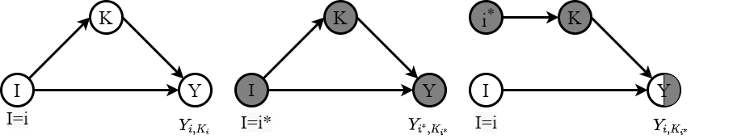 图4：因果图示例，其中I、Y和K分别表示原因、效果和中介变量。灰色节点意味着变量处于参考状态（例如：𝐼 = 𝑖∗).

### 3. 方法

在本节中，我们首先详细介绍了反事实推理的关键概念（第3.1节），然后是推荐过程的因果观点（第3.2节），MACR框架的引入（第3.3节），以及它消除流行偏见的合理性（第3.4节）。最后，我们讨论了当辅助信息可用时，MACR的可能扩展（第3.5节）。

#### 3.1 准备工作

- 因果图。因果图是一个有向无环图 $G=\{V,E\}$ ，这里 $V$ 表示变量集 $E$ 表示变量之间的因果关系[35]。在因果图中，大写字母（例如：$I$）表示变量，小写字母（例如：$i$）表示其观测值。边缘意味着祖先节点是原因（$I$）并且后继节点是一种效果（$Y$）。以图4为例，$I\rightarrow Y$意味着存在来自 $I$ 到 $Y$。此外 $I\rightarrow K\rightarrow Y$ 方法 $I$ 对 $Y$ 通过调解人 $K$。根据因果图 $Y$ 可以根据其祖先节点的值来计算，其公式化为：
  $$
  Y_{i,k}=Y(I=i,K=k),
  \tag{2}
  $$
  其中，$Y(.)$ 表示 $Y$ 函数的值。同样，中介的值可以通过 $k=K_i=K(I=i)$ 获得。特别是，我们可以实例化 $K(I)$ 和 $Y(I,K)$ 作为神经算子（例如，完全连接层），并组成一个解，它根据输入I预测Y值。

- 因果关系。$I$ 对 $Y$ 的因果影响是目标变量 $Y$ 因祖先变量 $I$ 的单位变化而变化的幅度[35]。例如，$I=i$ 对 $Y$ 的总效应（TE）定义为：
  $$
  TE=Y_{i,K_i}-Y_{i^{*},K_{i^{*}}},
  \tag{3}
  $$
  它可以被理解为两种假设情况 $I=i$ 和 $I=i^{*}$ 之间的差异。$I=i^{*}$ 指的是 $I$ 的值从现实中静默的情况，通常将值设为null。$K_{i^{*}}$表示 $I=i^{*}$ 时 $K$ 的值。此外，根据因果图的结构，TE可以分解为自然直接效应（NDE）和总间接效应（TIE），分别表示通过直接路径 $I\rightarrow Y$ 和间接路径 $I\rightarrow K\rightarrow Y$ 的影响[ 35 ]。NDE表示在 $I\rightarrow Y$ 的直接路径上， $I$ 从 $i^{*}$ 变化到 $i$ 时 $Y$ 的值变化，$K$ 设定为 $I=i^{*}$ 时的值，公式为：
  $$
  NDE=Y_{i,K_{i^{*}}}-Y_{i^{*},K_{i^{*}}},
  \tag{4}
  $$
  其中 $Y_{i,K_{i^{*}}}=Y(I=i,K=K(I=i^{*}))$。$Y_i$，$K_{i^{*}}$ 的计算是一个反事实推断，因为它要求同一变量 $I$ 的值在不同的路径（见图4）上设置不同的值。因此，TIE可以通过TE减去NDE得到：
  $$
  TIE=TE-NDE=Y_{i,K_{i}}-Y_{i,K_{i^{*}}},
  \tag{5}
  $$
  它表示 $I$ 通过间接路径 $I\rightarrow K\rightarrow Y$ 对 $Y$ 的影响。

#### 3.2 推荐中的因果发现

在图2（a）中，我们首先抽象了大多数现有推荐模型的因果图，其中 $U,I,K$ 和 $Y$ 分别表示用户嵌入、项目嵌入、用户项目匹配特征和排名得分。这些模型有两个主要组成部分：匹配函数 $K(U,I)$ 学习用户和项目之间的匹配特征；以及评分函数 $Y(K)$。例如，最流行的MF模型将这些功能实现为用户和项目嵌入之间的元素乘积，以及嵌入维度之间的总和。至于其神经扩展NCF[22]，评分函数被一个完全连接的层所取代。沿着这条路线，人们对这些功能的设计给予了极大的关注。例如，LightGCN[20]和NGCF[49]采用图卷积进行匹配特征学习，ONCF[21]采用卷积层作为评分函数。然而，这些模型丢弃了直接影响排名得分的用户一致性和项目受欢迎程度。

图2（c）描述了一个更完整的推荐因果图，其中路径 $U\rightarrow Y$ 和 $I\rightarrow Y$ 分别表示用户和项目对评分的直接影响。少数推荐模型遵循这一因果图，如附加用户和项目偏好项的MF[28]和将用户和项目嵌入作为其评分函数的附加输入的NeuMF[22]。虽然这些模型都是通过前向传播进行推理，但是图2（a）和图2（c）中推理的因果视图不同，分别是 $Y_{K_{u,i}}$ 和 $Y_{u,i,K_{u,i}}$ 。然而，现有工作在训练和测试阶段都对它们一视同仁。为了简单起见，我们使用 $\hat{y}_{ui}$ 来表示排名分数，它通过一个推荐损失（如BCE损失）来监督恢复历史交互[54]：
$$
L_{O}=\sum_{(u,i)\in D}-y_{ui}log(\sigma(\hat{y}_{ui}))-(1-y_{ui})log(1-\sigma(\hat{y}_{ui})),
\tag{6}
$$
其中，$D$ 表示训练集，$\sigma(·)$ 表示sigmoid函数。$\hat{y}_{u,i}$ 指 $Y_{K_{u,i}}$ 或 $Y_{u,i,K_{u,i}}$ 。在测试阶段，将排名得分较高的项目推荐给用户。

这些推荐模型大多存在流行度偏差（见图1）。这是因为 $\hat{y}_{ui}$ 是用户 $u$ 与物品 $i$ 交互的可能性，由训练数据估计得到，不可避免地偏向数据中的热门物品。从因果视角来看，项目流行度通过 $I\rightarrow Y$ 直接影响 $\hat{y}_{ui}$，从而影响流行项目的排名得分。因此，阻断项目流行度对 $Y$ 的直接影响将消除流行度偏差。

#### 3.3 模型无关的反事实推理

为此，我们设计了一个模型无关的反事实推理（MACR）框架，通过多任务学习进行推荐器训练，通过反事实推理进行去偏推荐。如图5所示，该框架遵循图2（c）中的因果图，其中三个分支分别对应路径 $U\rightarrow Y$、$U\& I\rightarrow K\rightarrow Y$ 和 $I\rightarrow Y$。该框架只需增加一个用户模块 $Y_u(U)$ 和一个物品模块 $Y_i(I)$，即可在遵循 $U\& I\rightarrow K\rightarrow Y$ 结构的现有推荐模型上实现。这些模块将用户和项目嵌入投影到排序得分中，可以实现为多层感知器。形式上，

- 用户-项目匹配：$\hat{y}_k=Y_k(K(U=u,I=i))$ 是来自现有推荐器的排序得分，反映了项目 $i$ 在多大程度上匹配了用户 $u$ 的偏好。
- 项目模块：$\hat{y}_i=Y_i(I=i)$ 表示项目受欢迎程度的影响，越受欢迎的项目得分越高。
- 用户模块：$\hat{y}_u=Y_u(U=u)$ 表示无论偏好是否匹配，用户 $u$ 在多大程度上会与物品进行交互。考虑到两个用户被随机推荐相同数量的视频的情况，一个用户可能由于更广泛的偏好或更强的从众性而点击更多的视频。这种“容易”的用户期望获得更高的 $\hat{y}_u$ 值，并且受项目流行度的影响更大。

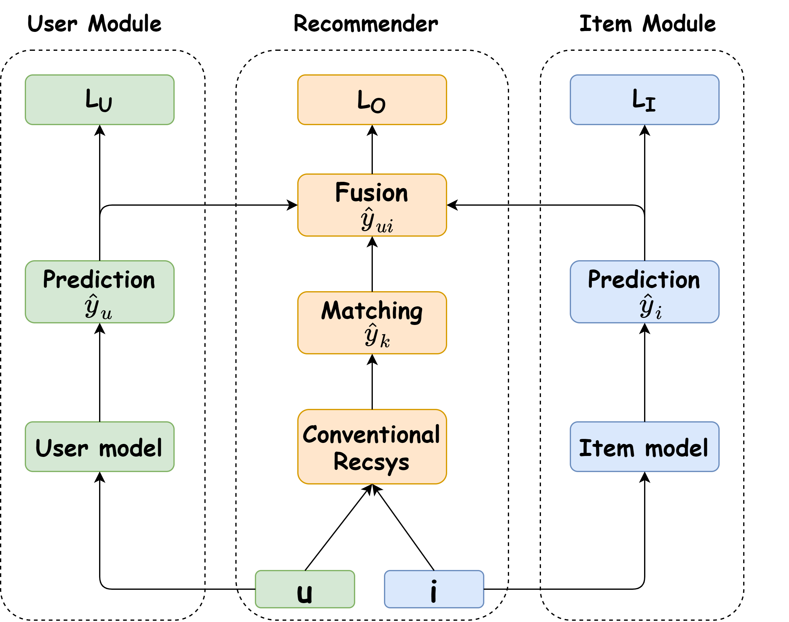 图5：MACR框架。橙色矩形表示主分支，即传统的推荐系统。蓝色和绿色矩形分别表示用户和物品模块。

由于训练目标是恢复历史交互 $y_{ui}$，因此将三个分支聚合成一个最终的预测分数：
$$
\hat{y}_{ui}=\hat{y}_k\ast\sigma(\hat{y}_i)\ast\sigma(\hat{y}_u),
\tag{7}
$$
其中 $\sigma(·)$ 表示sigmoid函数，它将 $\hat{y}_u$ 和 $\hat{y}_i$ 缩放为[0, 1]范围内的点击概率，以调整依赖用户-项目匹配（即 $\hat{y}_k$）来恢复历史交互的程度。例如，为了恢复不活跃用户和不受欢迎项目之间的交互，模型将被推送以突出用户-项目匹配，即放大 $\hat{y}_k$。

**训练推荐器。**

类似于（6），我们仍然可以在整体排名分数 $\hat{y}_{ui}$ 上施加一个推荐损失。为了实现用户和项目模块的效果，我们设计了一种多任务学习模式，对 $\hat{y}_u$ 和 $\hat{y}_i$ 施加额外的监督。形式上，训练损失为：
$$
L=L_{O}+\alpha\ast L_{I}+\beta\ast L_{U},
\tag{8}
$$
其中 $\alpha$ 和 $\beta$ 为trade-off超参数。与 $L_O$ 相似，$L_I$ 和 $L_U$ 也是推荐损失：
$$
L_{U}=\sum_{(u,i)\in D}-y_{ui}log(\sigma(\hat{y}_{u}))-(1-y_{ui})log(1-\sigma(\hat{y}_{u})),\\
L_{I}=\sum_{(u,i)\in D}-y_{ui}log(\sigma(\hat{y}_{i}))-(1-y_{ui})log(1-\sigma(\hat{y}_{i})).
$$

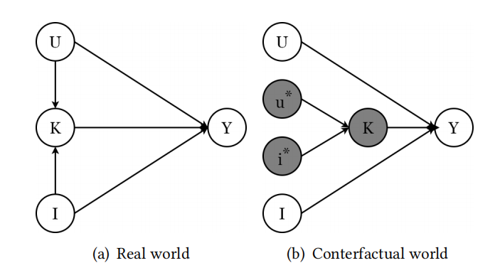 图6：推荐系统中真实世界与反事实世界因果图的比较。

**反事实推断。**

如前所述，消除流行度偏差的关键在于从排名分数 $\hat{y}_{ui}$ 中去除路径 $I\rightarrow Y$ 的直接影响。为此，我们进行的推荐根据：
$$
\hat{y}_{k}\ast\sigma(\hat{y}_{i})\ast\sigma(\hat{y}_{u})-c\ast\sigma(\hat{y}_{i})\ast\sigma(\hat{y}_{u}),
\tag{9}
$$
其中 $c$ 是一个超参数，表示 $\hat{y}_k$ 的参考状态。推论的合理性将在下文详述。直觉上，该推断可以理解为根据 $\hat{y}_{ui}$ 对排名进行调整。假设两个项目 $i$ 和 $j$ 与 $\hat{y}_{ui}$ 略低于 $\hat{y}_{uj}$，项目 $j$ 将在共同推断中排在 $i$ 前面。我们的调整会影响 $j$ 是否比 $i$ 更受欢迎，其中 $\hat{y}_{j}>>\hat{y}_{i}$。由于第二部分的减法，不受欢迎的项目 $i$ 将排在 $j$ 的前面。这种调整的规模是用户特定的，由 $\hat{y}_{u}$ 控制，其中较大的调整将针对“容易”的用户进行。

#### 3.4 去偏差推断的合理性

如图2（c）所示，$I$ 通过两条路径影响 $Y$，间接路径 $I\rightarrow K\rightarrow Y$ 和直接路径 $I\rightarrow Y$。根据3.1节中的反事实表示法，我们通过反事实推理计算从 $I$ 到 $Y$ 的NDE，其中反事实推荐系统（图6（b））在不考虑用户-项目匹配的情况下分配排名分数。可以看出，以 $I,K_{u^{*},i^{*}}$ 为参考值的特征匹配函数 $K(U,I)$ 对间接路径进行了遮挡。形式上，NDE给出为：
$$
NDE=Y(U=u,I=i,K=K_{u^{*},i^{*}})-Y(U=u^{*},I=i^{*},K=K_{u^{*},i^{*}})),
$$
其中，$u^*$ 和 $i^*$ 表示 $U$ 和 $I$ 的参考值，通常设置为相应变量的均值，即用户和项目嵌入的均值。

根据式（3）， $I$ 到 $Y$ 的TE可以写为：
$$
TE=Y(U=u,I=i,K=K_{u,i})-Y(U=u^{*},I=i^{*},K=K_{u^{*},i^{*}})).
$$
因此，消除流行度偏差可以通过将TE减去NDE来实现，其公式为：
$$
TE-NDE=Y(U=u,I=i,K=K_{u,i})-Y(U=u,I=i,K=K_{u^{*},i^{*}}),
\tag{10}
$$

表1：五个不同的数据集的统计数据

|         | Users   | Items  | Interactions | Sparsity |
| ------- | ------- | ------ | ------------ | -------- |
| Adressa | 13,485  | 744    | 116,321      | 0.011594 |
| Globo   | 158,323 | 12,005 | 2,520,171    | 0.001326 |
| ML10M   | 69,166  | 8,790  | 5,000,415    | 0.008225 |
| Yelp    | 31,668  | 38,048 | 1,561,406    | 0.001300 |
| Gowalla | 29,858  | 40,981 | 1,027,370    | 0.000840 |

回想一下，排名分数是根据公式7计算的。因此，我们有 $Y(U=u,I=i,K=K_{u,i})=\hat{y}_k\ast\sigma(\hat{y}_i)\ast\sigma(\hat{y}_u)$ 和 $Y(U=u,I=i,K=K_{u^{*},i^{*}})=c\ast\sigma(\hat{y}_i)\ast\sigma(\hat{y}_u)$，其中 $c$ 表示 $K=K_{u^{*},i^{*}}$ 时 $\hat{y}_{k}$ 的值。这样，我们得到测试阶段的排序模式如式9。回想一下 $TIE=TE-NDE$，本文提出的反事实推断与正态推断的关键区别在于使用 $TIE$ 对项进行排序而非 $TE$。附录A中的算法描述了我们方法的过程。

#### 3.5 讨论

点击一个项目通常有多种原因，例如项目的受欢迎程度、类别和质量。在这项工作中，我们关注的是相互作用频率所揭示的偏差。作为从因果角度解决问题的初步尝试，我们忽略了其他因素的影响。由于无法获得关于这些因素的辅助信息[39]，或者暴露机制无法揭示建议的不同原因，因此解释这些因素也很重要。

由于我们可以访问这些辅助信息，我们可以简单地扩展所提出的MACR框架，将这些信息作为附加节点纳入因果图中。然后，我们可以揭示导致具体建议的原因，并尝试进一步消除偏见，这将留给未来的探索。

### 4. 实验

在本节中，我们进行实验来评估我们提出的MACR的性能。我们的实验旨在回答以下研究问题：

- RQ1：MACR是否优于现有的去偏方法？

- RQ2：不同的超参数设置（例如，$\alpha,\beta,c$）如何影响推荐表现？

- RQ3：我们框架中的不同组件如何对性能做出贡献？

- RQ4：MACR如何消除流行偏差？

#### 4.1 实验设置

**数据集。**在我们的实验中使用了五个真实世界的基准数据集：ML10M是MovieLens广泛使用的[6，40，59]数据集，有10M的电影评分。虽然它是一个显式反馈数据集，但我们有意选择它来研究从隐式信号中学习的性能。为此，我们将其转换为隐式数据，其中每个条目都标记为0或1，指示用户是否对项目进行了评级；Adresa[18]和Globo[14]是两个流行的新闻推荐数据集；此外，LightGCN[20]中的数据集Gowalla和Yelp用于公平比较。上述所有数据集都是公开的，并且在域、大小和稀疏性方面有所不同。表1总结了这些数据集的统计数据。

**评价。**请注意，对一组拒绝交互的传统评估策略并不能反映预测用户偏好的能力，因为它仍然遵循长尾分布[58]。因此，即使只考虑受欢迎程度而忽略用户的偏好，测试模型仍然可以表现良好[58]。因此，传统的评估策略不适合测试模型是否存在流行性偏差，我们需要对去偏数据进行评估。为此，我们遵循之前的工作[7，30，58]来模拟去偏推荐，其中测试交互被采样为在项目上的均匀分布。特别是，我们以相同概率随机抽取10%的交互项目作为测试集，另10%作为验证集，其余作为有偏差的训练数据1。我们报告了三个广泛使用的指标的所有排名性能：命中率（HR）、召回率和归一化贴现累积增益（NDCG）削减 $K$。

##### 4.1.1 基线

我们使用经典的MF（MACR_MF）和最先进的LightGCN（MACR_LightGCN）来实现我们的MACR，以探索MACR如何提高推荐性能。我们将我们的方法与以下基线进行比较：

- MF[28]：这是一个具有代表性的协同过滤模型，如第3.2节所述。
- LightGCN[20]：这是最先进的基于光图卷积的协作过滤推荐模型，如第3.2节所示。
- ExpoMF[31]：一个概率模型，分别估计用户偏好和暴露。
- CausE_MF，CausE_LightGCN[7]：CauseE是一种域自适应算法，它从去偏数据集中学习，以利于有偏训练。在我们的实验中，我们将训练集分为去偏训练集和有偏训练集来实现这种方法。此外，我们将CauseE应用于两个推荐模型（即MF和LightGCN），以进行公平比较。下面的debias策略也采用了类似的处理方法。
- BS_MF，BS_LightGCN[28]：BS从训练阶段学习有偏差的分数，然后在测试阶段消除预测中的偏差。预测函数定义为：$\hat{y}_{ui}=\hat{y}_{k}+b_{i}$，其中 $b_{i}$ 是项目的偏差项 $i$。
- Reg_MF，Reg_LightGCN[2]：Reg是一种基于正则化的方法，它有意降低短尾项目的权重，覆盖更多项目，从而改进长尾推荐。
- IPW_MF，IPW_LightGCN[30，42]I：PW将标准的反向倾向权重添加到重新加权样本中，以缓解物品流行度偏差。
- DICE_MF，DICE_LightGCN[58]：这是一种最先进的学习因果嵌入的方法，用于处理流行性偏见问题。它设计了一个具有因果特定数据的框架，将兴趣和流行度分解为两组嵌入。我们使用了作者提供的代码。

由于我们的目标是对用户和项目之间的交互进行建模，因此我们不会与使用辅助信息的模型进行比较。我们省略了与其他协同过滤模型的比较，如NeuMF[22]和NGCF[49]，因为LightGCN[20]是目前最先进的协同过滤方法。模型的实现细节和详细的参数设置见附录B。

*关于从有偏数据中提取去偏测试集的详细信息，我们参考[7，30，58]。*

表2：K=20时比较方法的性能评估。Rec是指召回。粗体表示该列中的获胜者。请注意，MACR实现的改进是显著的（p-value<<0.05）

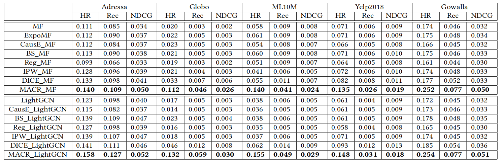

#### 4.2 结果（RQ1）

表2显示了比较方法在以下方面的推荐性能HR@20，Recall@20和NDCG@20。粗体表示该列中的获胜者。总的来说，我们的MACR在所有数据集的所有指标上始终优于所有比较方法。主要观察结果如下：

- 在所有情况下，我们的MACR都会大幅提升MF或LightGCN。具体而言，就HR@20并且MACR_LightGCN相对于LightGCN的改进为241.98%，这是相当可观的。这些令人印象深刻的结果证明了我们的多任务训练模式和反事实推理的有效性，即使这里我们只使用简单的项目和用户模块。MACR可以通过设计更复杂的模型来进一步改进。
- 在大多数情况下，LightGCN的性能比MF差，但在常规数据集拆分中，如[20]中所述，LightGCN通常是一种性能更好的方法。如图1所示，在相同的训练集下，我们可以看到LightGCN上流行项目的平均推荐频率明显大于MF。这一结果表明LightGCN更容易受到流行偏见的影响。原因可归因于LightGCN中的嵌入传播操作，其中流行项目的影响在用户-项目交互图上传播，这进一步放大了流行偏见。然而，在我们的MACR框架中，MACR_LightGCN的性能要好于MACR_MF。这表明我们的框架可以在很大程度上缓解流行偏见。
- 在数据集方面，我们还可以发现，与Globo数据集相比，改进幅度非常大。这是因为Globo是一个大规模的新闻数据集，其受欢迎程度分布尤其倾斜。环球网的热门新闻被广泛阅读，而其他一些不受欢迎的新闻几乎没有点击量。这一结果表明我们的模型有能力解决流行性偏见，尤其是在长尾数据集上。
- 关于流行度去偏的基线，Reg方法[2]在基本模型上的改进有限，有时甚至表现得更糟。原因是Reg只是简单地降低了热门项目的权重，而没有考虑它们对每次互动的影响。CauseE有时也表现不佳，因为它依赖于去偏训练集，而去偏训练集中通常相对较小，并且模型很难从中学习有用的信息。BS和IPW方法可以在一定程度上缓解偏差问题。DICE在基线中取得了最好的结果。这表明了将受欢迎程度视为互动原因的重要性。

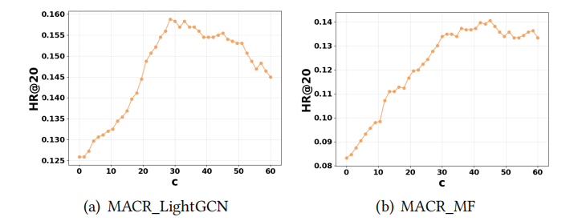 图7：MACR_LightGCN和MACR_MF中，c对HR@20的影响

在附录C.1中，我们还报告了我们在Adressa数据集上的实验结果，为了更全面的评估，我们使用了不同的 $K$ 值。

#### 4.3 案例研究

##### 4.3.1 超参数的影响（RQ2）

我们的框架有三个重要的超参数，$\alpha$、$\beta$ 和 $c$。限于篇幅，我们在附录C.2中给出 $\alpha$、$\beta$ 的参数敏感性分析结果。

方程（9）中公式化的超参数 $c$ 控制中间匹配偏好在预测中被阻止的程度。我们在MACR_LightGCN和MACR_MF上的Adressa数据集上进行了实验，并测试了它们在HR@20方面的性能。如图7所示，以MACR_LightGCN为例，随着 $c$ 从0到29的变化，模型的性能越来越好，而进一步增加 $c$ 会适得其反。这说明适当程度的阻塞中间匹配偏好有利于流行度去偏并提高推荐性能。

与MACR_MF相比，MACR_LightGCN对 $c$ 更敏感，因为它的性能在优化后下降得更快。这表明LightGCN更容易受到流行偏见的影响，这与我们在第4.2节中的发现一致。

表3：用户和项目分支对MACR_MF的影响

|                         | HR@20     | Recall@20 | NDCG@20   |
| ----------------------- | --------- | --------- | --------- |
| MACR_MF                 | **0.140** | **0.109** | **0.050** |
| MACR_MF w/o user branch | 0.137     | 0.106     | 0.046     |
| MACR_MF w/o item branch | 0.116     | 0.089     | 0.038     |
| MACR_MF w/o LI          | 0.124     | 0.096     | 0.043     |
| MACR_MF w/o LU          | 0.138     | 0.108     | 0.048     |

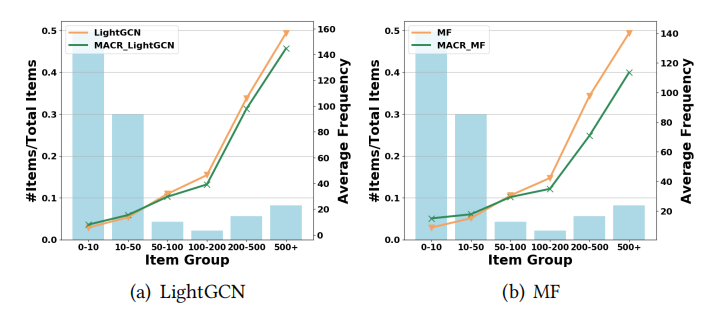 图8：LightGCN（MF）和MACR_LightGCN推荐的不同项目组的频率

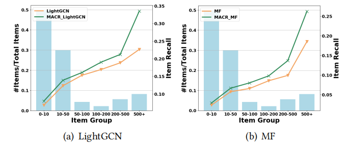 图9：Adressa上不同商品组的平均商品召回率。

##### 4.3.2 用户分支和项目分支的影响（RQ3）

值得注意的是，我们的MACR不仅在损失函数中纳入了用户/项目的影响，而且在预测中融合了用户/项目的影响。为了考察用户分支和项目分支的整体效应，我们在Adressa数据集上对MACR_MF进行了消融研究，并一次去除不同的成分进行比较。具体地，我们将MACR与其4种特殊情况进行比较：MACR_MF w/o 用户（项目）分支，其中用户（或项目）分支已被移除；MACR_MF w/o $L_I(L_U)$，我们只是简单地移除 $L_I(L_U)$，以阻止用户（或项目）分支对训练的影响，但保留它们对预测的影响。

从表3中我们可以发现，用户分支和项目分支都提高了推荐性能。与删除用户分支相比，该模型在删除项目分支时的性能要差得多。同样，与移除相比 $L_U$, 移除 $L_I$ 也会对性能造成更严重的损害。这一结果验证了项目流行度偏见对推荐的影响大于用户一致性。

此外，与简单地移除相比 $L_I$ 和 $L_U$, 删除用户/项目分支会使模型的性能变差。这一结果验证了在预测中进一步融合项目和用户影响的重要性。

##### 4.3.3 去偏能力（RQ4）

然后，我们调查我们的模型是否缓解了流行偏见问题。我们将MACR_MF和MACR_LightGCN与它们的基本模型MF和LightGCN进行了比较。如图8所示，我们显示了不同项目组的推荐频率。我们可以看到，我们的方法确实降低了热门项目的推荐频率，并推荐了更多不太受欢迎的项目。然后，我们在图9中进行了一个实验，以显示不同项目组中的项目推荐召回。在这个实验中，我们向每个用户推荐20个项目，并计算项目召回率。如果一个项目在测试数据中出现N次，那么它的项目召回率就是它被准确推荐给测试用户的比例。我们有以下发现。

- 最受欢迎的项目组的召回率增长最大，但我们在图8中的方法显示，受欢迎项目的推荐频率降低了。这意味着传统的推荐系统（MF、LightGCN）由于流行偏见，倾向于向无关用户推荐更受欢迎的项目。相比之下，我们的MACR减少了商品的直接影响，并主要向合适的用户推荐受欢迎的商品。这证实了匹配用户和项目进行个性化推荐的重要性，而不是依赖项目相关的偏见。
- 不受欢迎的项目组有相对较小的改进。这种改进主要是因为我们向用户推荐了更多不受欢迎的项目，如图8所示。由于这些项目很少出现在训练集中，因此很难获得这些项目的全面表示，因此我们的方法很难得到很大的改进。

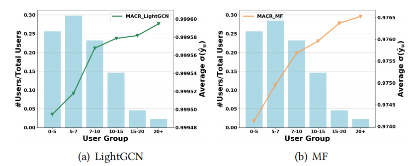 图10：Adressa上不同用户组的平均σ(yu)比较

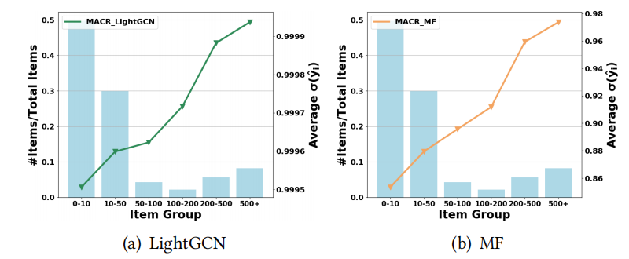 图11：Adressa上不同项目组的平均σ(yi)比较

为了研究为什么我们的框架有利于推荐中的去偏，我们探索了什么用户分支和项目分支，即 $\hat{y}_{u}$ 和 $\hat{y}_{i}$，实际在模型中学习。我们比较 $\sigma(\hat{y}_{u})$ 和 $\sigma(\hat{y}_{i})$ 如公式（7）所示，这是特定用户 $u$ 或项目 $i$ 的输出，从sigmoid函数后的用户/项目模型中，捕捉数据集中的用户一致性和项目流行度。在图10中，背景直方图表示数据集中每个组中用户的比例。横轴表示具有一定数量交互的用户组。左纵轴是背景直方图的值，它对应于用户在数据集中的比例。右侧垂直轴是多段线的值，对应于 $\sigma(\hat{y}_{u})$。所有值都是组中用户的平均值。正如我们所看到的，随着用户在数据集中出现频率的增加，他们的sigmoid得分也在增加。这表明用户的活动与他/她的一致性水平是一致的。在图11中可以观察到不同项目组的类似现象。这表明我们的模型能够捕捉商品的流行度和用户的一致性，从而使去偏受益。

### 5. 相关工作

在本节中，我们回顾了与这项工作最相关的关于推荐中的流行偏见和推荐中的因果推理的现有工作。

#### 5.1 推荐中的流行偏差

流行性偏差是推荐系统中的一个常见问题，因为训练数据集中的流行项目经常被推荐。研究人员已经探索了许多方法[2，9，10，23，24，44，51，58]来分析和缓解推荐系统中的流行偏见。第一条研究线是基于上一节中描述的反向倾向加权（IPW）[41]。这种方法的核心思想是重新加权训练损失中的相互作用。例如，Liang等人[30]建议对流行物品施加较低的权重。具体地说，权重被设置为物品受欢迎程度的倒数。然而，这些先前的方法忽略了流行度如何影响每一个特定的互动。

另一条研究路线试图通过排名调整来解决这个问题。例如，Abdollahpouri等人[2]提出了一种基于正则化的方法，旨在提高长尾项的秩。Abdollahpouri等人[3]介绍了一种可应用于推荐系统输出的重新排序方法。这些方法导致在推荐准确性和不受欢迎项目的覆盖范围之间进行权衡。他们通常会因为以野蛮的方式将推荐者推到长尾而遭受准确性下降的影响。与现有的工作不同，我们从一个新颖的因果视角探索消除流行偏见。我们建议通过多任务训练模式来捕捉流行度偏差，并在预测阶段通过反事实推理来消除偏差。

#### 5.2 推荐中的因果推理

因果推断是系统分析因果关系的科学[35]。最近，因果推理逐渐引起了人们的注意，并被广泛用于机器学习任务，如场景图生成[13，46]、视觉解释[32]、视觉语言多模态学习[34，37，47，56]、节点分类[15]、文本分类[38]和自然语言推理[16]。在推荐系统中引入因果推理的主要目的是消除偏见[4，5，8，25，42，48，57]。我们向读者介绍了一项系统调查，以了解更多细节[12]。

**反向倾向权重。**

第一行工作基于反向倾向加权（IPW）。在[30]中，作者提出了一个由两个模型组成的框架：一个暴露模型和一个偏好模型。一旦估计了曝光模型，偏好模型就与加权点击数据相拟合，其中每个点击都由第一模型中估计的曝光的倒数来加权，从而用于缓解流行度偏差。[42，50]中提出了一些非常相似的模型。

**以因果关系为导向的数据。**

第二行工作是利用额外的去偏数据。在[7]中，他们提出创建一个去偏训练数据集作为辅助任务，以帮助在偏斜数据集中训练的模型更好地泛化，这也可以用来缓解流行度偏差。他们将数据集的大样本视为有偏见的反馈数据，并将推荐建模为领域自适应问题。但我们认为，他们的方法并没有明确消除流行偏见，在正常数据集上也表现不佳。注意，所有这些方法都旨在减少用户暴露的偏见。

**因果嵌入。**

另一系列工作是基于概率的，在[31]中，作者提出了ExpoMF，这是一种对隐式数据进行协作过滤的概率方法，将用户对项目的暴露直接纳入协作过滤。ExpoMF联合建模了用户对某个项目的接触，以及他们由此产生的点击决策，从而产生了一个模型，该模型自然地降低了预期但最终未点击的项目的权重。暴露被建模为一个潜在变量，模型从数据中推断其值。项目的受欢迎程度可以作为暴露协变量添加，从而用于缓解受欢迎程度偏差。这类作品是基于概率的，因此不能推广到更普遍的环境中。此外，他们忽略了受欢迎程度如何影响每一种特定的互动。与我们的工作类似，Zheng等人[58]也试图通过因果方法来缓解流行偏见。不同之处在于，我们以细粒度的方式分析因果关系，考虑项目受欢迎程度、用户一致性，并建模它们对推荐的影响。[58]也缺乏对流行偏见机制的系统观点。

### 6. 结论与未来工作

在本文中，我们提出了第一个因果观点来缓解推荐系统中的流行偏见问题。我们提出了模型不可知框架MACR，该框架根据因果图进行多任务训练，以评估不同原因对排名得分的贡献。进行反事实推理以估计项目属性对排名分数的直接影响，并将其去除以消除流行度偏差。在五个真实世界的推荐数据集上进行的大量实验已经证明了MACR的有效性。

这项工作代表了利用因果推理进行推荐的初步尝试之一，并开辟了新的研究可能性。未来，我们将把因果观扩展到推荐系统中的更多应用，并探索用户和项目模块的其他设计，以更好地捕捉用户一致性和项目受欢迎程度。此外，我们想探索如何结合各种辅助信息[39]，以及如何扩展我们的框架以缓解推荐系统中的其他偏见[12]。此外，我们将研究通过反事实推理同时消除流行偏见和暴露偏见等多种类型的偏见。此外，我们将探索因果关系和其他关系领域知识的结合[33]。

### 致谢

这项工作得到了国家自然科学基金（U19A2079，61972372）和国家重点研发计划（2020AAA0106000）的支持。

### 参考文献

[1] Martín Abadi, Paul Barham, Jianmin Chen, Zhifeng Chen, Andy Davis, Jeffrey Dean, Matthieu Devin, Sanjay Ghemawat, Geoffrey Irving, Michael Isard, et al. 2016. Tensorflow: A system for large-scale machine learning. In *OSDI*. 265–283.

[2] Himan Abdollahpouri, Robin Burke, and Bamshad Mobasher. 2017. Controlling popularity bias in learning-to-rank recommendation. In *RecSys*. 42–46.

[3] Himan Abdollahpouri, Robin Burke, and Bamshad Mobasher. 2019. Managing popularity bias in recommender systems with personalized re-ranking. In *FLAIRS*.

[4] Aman Agarwal, Kenta Takatsu, Ivan Zaitsev, and Thorsten Joachims. 2019. A general framework for counterfactual learning-to-rank. In *SIGIR*. 5–14.

[5] Alejandro Bellogín, Pablo Castells, and Iván Cantador. 2017. Statistical biases in Information Retrieval metrics for recommender systems. *Inf. Retr. J.* (2017), 606–634.

[6] Rianne van den Berg, Thomas N Kipf, and Max Welling. 2018. Graph convolutional matrix completion. *KDD Deep Learning Day* (2018).

[7] Stephen Bonner and Flavian Vasile. 2018. Causal embeddings for recommendation. In *RecSys*. 104–112.

[8] Léon Bottou, Jonas Peters, Joaquin Quiñonero-Candela, Denis X Charles, D Max Chickering, Elon Portugaly, Dipankar Ray, Patrice Simard, and Ed Snelson. 2013. Counterfactual reasoning and learning systems: The example of computational advertising. *JMLR* (2013), 3207–3260.

[9] Rocío Cañamares and Pablo Castells. 2017. A probabilistic reformulation of memory-based collaborative filtering: Implications on popularity biases. In *SIGIR*. 215–224.

[10] Rocío Cañamares and Pablo Castells. 2018. Should I follow the crowd? A probabilistic analysis of the effectiveness of popularity in recommender systems. In *SIGIR*. 415–424.

[11] Allison J. B. Chaney, Brandon M. Stewart, and Barbara E. Engelhardt. 2018. How Algorithmic Confounding in Recommendation Systems Increases Homogeneity and Decreases Utility. In *RecSys*. 224–232.

[12] Jiawei Chen, Hande Dong, Xiang Wang, Fuli Feng, Meng Wang, and Xiangnan He. 2020. Bias and Debias in Recommender System: A Survey and Future Directions. *arXiv preprint arXiv:2010.03240* (2020).

[13] Long Chen, Hanwang Zhang, Jun Xiao, Xiangnan He, Shiliang Pu, and Shih Fu Chang. 2019. Counterfactual critic multi-agent training for scene graph generation. In *ICCV*. 4613–4623.

[14] Gabriel de Souza Pereira Moreira, Felipe Ferreira, and Adilson Marques da Cunha. 2018. News session-based recommendations using deep neural networks. In *Workshop on Deep Learning at RecSys*. 15–23.

[15] Fuli Feng, Weiran Huang, Xiangnan He, Xin Xin, Qifan Wang, and Tat-Seng Chua Chua. 2021. Should Graph Convolution Trust Neighbors? A Simple Causal Inference Method. In *SIGIR*.

[16] Fuli Feng, Jizhi Zhang, Xiangnan He, Hanwang Zhang, and Tat-Seng Chua. 2021. Empowering Language Understanding with Counterfactual Reasoning. In *ACL* *IJCNLP Findings*.

[17] Xavier Glorot and Yoshua Bengio. 2010. Understanding the difficulty of training deep feedforward neural networks. In *AISTATS*. 249–256.

[18] Jon Atle Gulla, Lemei Zhang, Peng Liu, Özlem Özgöbek, and Xiaomeng Su. 2017. The Adressa dataset for news recommendation. In *WI*. 1042–1048.

[19] Guibing Guo, Jie Zhang, and Neil Yorke-Smith. 2015. Trustsvd: Collaborative filtering with both the explicit and implicit influence of user trust and of item ratings.. In *AAAI*. 123–125.

[20] Xiangnan He, Kuan Deng, Xiang Wang, Yan Li, Yongdong Zhang, and Meng Wang. 2020. LightGCN: Simplifying and Powering Graph Convolution Network for Recommendation. In *SIGIR*. 639–648.

[21] Xiangnan He, Xiaoyu Du, Xiang Wang, Feng Tian, Jinhui Tang, and Tat-Seng Chua. 2018. Outer product-based neural collaborative filtering. In *IJCAI*. 2227–2233.

[22] Xiangnan He, Lizi Liao, Hanwang Zhang, Liqiang Nie, Xia Hu, and Tat-Seng Chua. 2017. Neural collaborative filtering. In *WWW*. 173–182.

[23] Amir Jadidinejad, Craig Macdonald, and Iadh Ounis. 2019. How Sensitive is Recommendation Systems’ Offline Evaluation to Popularity?. In *REVEAL Workshop* *at RecSys*.

[24] Dietmar Jannach, Lukas Lerche, Iman Kamehkhosh, and Michael Jugovac. 2015. What recommenders recommend: an analysis of recommendation biases and possible countermeasures. *User Model User-adapt Interact* (2015), 427–491.

[25] Ray Jiang, Silvia Chiappa, Tor Lattimore, András György, and Pushmeet Kohli. 2019. Degenerate feedback loops in recommender systems. In *AIES*. 383–390.

[26] Santosh Kabbur, Xia Ning, and George Karypis. 2013. Fism: factored item similarity models for top-n recommender systems. In *KDD*. 659–667.

[27] Diederik P Kingma and Jimmy Ba. 2014. Adam: A method for stochastic optimization. In *ICLR*.

[28] Yehuda Koren, Robert Bell, and Chris Volinsky. 2009. Matrix factorization techniques for recommender systems. *Computer* (2009), 30–37.

[29] Wenqiang Lei, Xiangnan He, Yisong Miao, Qingyun Wu, Richang Hong, Min Yen Kan, and Tat-Seng Chua. 2020. Estimation-action-reflection: Towards deep interaction between conversational and recommender systems. In *WSDM*. 304–312.

[30] Dawen Liang, Laurent Charlin, and David M Blei. 2016. Causal inference for recommendation. In *Workshop at UAI*.

[31] Dawen Liang, Laurent Charlin, James McInerney, and David M Blei. 2016. Modeling user exposure in recommendation. In *WWW*. 951–961.

[32] Álvaro Parafita Martínez and Jordi Vitrià Marca. 2019. Explaining Visual Models by Causal Attribution. In *ICCV Workshop*. 4167–4175.

[33] Liqiang Nie, Yongqi Li, Fuli Feng, Xuemeng Song, Meng Wang, and Yinglong Wang. 2020. Large-scale question tagging via joint question-topic embedding learning. *ACM TOIS* 38, 2 (2020), 1–23.

[34] Yulei Niu, Kaihua Tang, Hanwang Zhang, Zhiwu Lu, Xian-Sheng Hua, and JiRong Wen. 2021. Counterfactual VQA: A Cause-Effect Look at Language Bias. In *CVPR*.

[35] Judea Pearl. 2009. *Causality*. Cambridge Uiversity Press.

[36] Matjaž Perc. 2014. The Matthew effect in empirical data. *J R Soc Interface* (2014), 20140378.

[37] Jiaxin Qi, Yulei Niu, Jianqiang Huang, and Hanwang Zhang. 2020. Two causal principles for improving visual dialog. In *CVPR*. 10860–10869.

[38] Chen Qian, Fuli Feng, Lijie Wen, Chunping Ma, and Pengjun Xie. 2021. Counterfactual Inference for Text Classification Debiasing. In *ACL-IJCNLP*.

[39] Steffen Rendle. 2010. Factorization machines. In *ICDM*. 995–1000.

[40] Steffen Rendle, Li Zhang, and Yehuda Koren. 2019. On the difficulty of evaluating baselines: A study on recommender systems. *arXiv preprint arXiv:1905.01395*(2019).

[41] Paul R Rosenbaum and Donald B Rubin. 1983. The central role of the propensity score in observational studies for causal effects. *Biometrika* (1983), 41–55.

[42] Tobias Schnabel, Adith Swaminathan, Ashudeep Singh, Navin Chandak, and Thorsten Joachims. 2016. Recommendations as treatments: Debiasing learning and evaluation. In *ICML*. 1670–1679.

[43] Xuehua Shen, Bin Tan, and ChengXiang Zhai. 2005. Implicit user modeling for personalized search. In *CIKM*. 824–831.

[44] Wenlong Sun, Sami Khenissi, Olfa Nasraoui, and Patrick Shafto. 2019. Debiasing the human-recommender system feedback loop in collaborative filtering. In *Companion of WWW*. 645–651.

[45] Yueming Sun and Yi Zhang. 2018. Conversational recommender system. In *SIGIR*. 235–244.

[46] Kaihua Tang, Yulei Niu, Jianqiang Huang, Jiaxin Shi, and Hanwang Zhang. 2020. Unbiased scene graph generation from biased training. In *CVPR*. 3716–3725.

[47] Tan Wang, Jianqiang Huang, Hanwang Zhang, and Qianru Sun. 2020. Visual commonsense r-cnn. In *CVPR*. 10760–10770.

[48] Wenjie Wang, Fuli Feng, Xiangnan He, Hanwang Zhang, and Tat-Seng Chua. 2021. "Click" Is Not Equal to "Like": Counterfactual Recommendation for Mitigating Clickbait Issue. In *SIGIR*.

[49] Xiang Wang, Xiangnan He, Meng Wang, Fuli Feng, and Tat-Seng Chua. 2019. Neural Graph Collaborative Filtering. In *SIGIR*. 165–174.

[50] Yixin Wang, Dawen Liang, Laurent Charlin, and David M Blei. 2018. The deconfounded recommender: A causal inference approach to recommendation. *arXiv* *preprint arXiv:1808.06581* (2018).

[51] Tianxin Wei, Ziwei Wu, Ruirui Li, Ziniu Hu, Fuli Feng, Xiangnan He, Yizhou Sun, and Wei Wang. 2020. Fast Adaptation for Cold-Start Collaborative Filtering with Meta-Learning. In *ICDM*. 661–670.

[52] Le Wu, Peijie Sun, Yanjie Fu, Richang Hong, Xiting Wang, and Meng Wang. 2019. A neural influence diffusion model for social recommendation. In *SIGIR*. 235–244.

[53] Jun Xu, Xiangnan He, and Hang Li. 2020. Deep Learning for Matching in Search and Recommendation. *Found. Trends Inf. Ret.* 14 (2020), 102–288.

[54] Hong-Jian Xue, Xinyu Dai, Jianbing Zhang, Shujian Huang, and Jiajun Chen. 2017. Deep Matrix Factorization Models for Recommender Systems. In *IJCAI*. 3203–3209.

[55] Rex Ying, Ruining He, Kaifeng Chen, Pong Eksombatchai, William L Hamilton, and Jure Leskovec. 2018. Graph convolutional neural networks for web-scale recommender systems. In *KDD*. 974–983.

[56] Shengyu Zhang, Tan Jiang, Tan Wang, Kun Kuang, Zhou Zhao, Jianke Zhu, Jin Yu, Hongxia Yang, and Fei Wu. 2020. DeVLBert: Learning Deconfounded Visio-Linguistic Representations. In *ACMMM*. 4373–4382.

[57] Yang Zhang, Fuli Feng, Xiangnan He, Tianxin Wei, Chonggang Song, Guohui Ling, and Yongdong Zhang. 2021. Causal Intervention for Leveraging Popularity Bias in Recommendation. In *SIGIR*.

[58] Yu Zheng, Chen Gao, Xiang Li, Xiangnan He, Depeng Jin, and Yong Li. 2021. Disentangling User Interest and Conformity for Recommendation with Causal Embedding. In *WWW*.

[59] Yin Zheng, Bangsheng Tang, Wenkui Ding, and Hanning Zhou. 2016. A Neural Autoregressive Approach to Collaborative Filtering. In *ICML*. 764–773.

[60] Guorui Zhou, Xiaoqiang Zhu, Chenru Song, Ying Fan, Han Zhu, Xiao Ma, Yanghui Yan, Junqi Jin, Han Li, and Kun Gai. 2018. Deep interest network for click-through rate prediction. In *KDD*. 1059–1068.

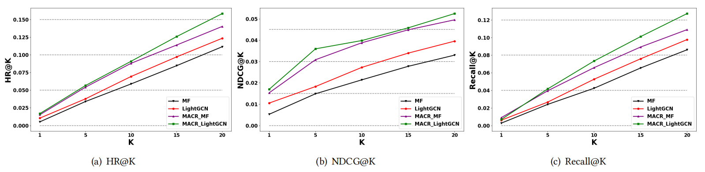 图12：Adressa数据集上的Top-K推荐性能，通过HR@K, NDCG@K和Recall@K

### A 推理程序

算法1描述了我们的方法和传统推荐系统的过程。

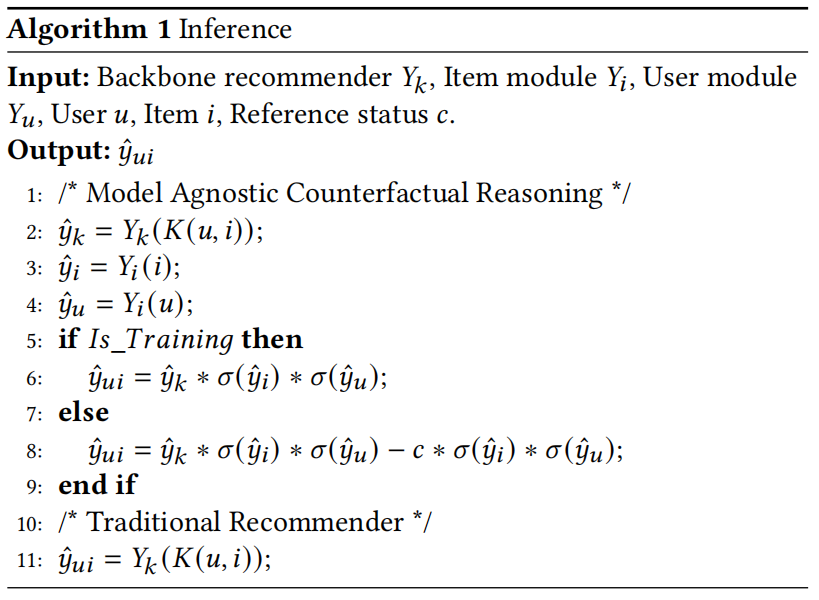

### B 实现细节

我们在Tensorflow[1]中实现了MACR。所有模型的嵌入大小固定为64，嵌入参数使用Xavier方法进行初始化[17]。我们用Adam[27]优化了所有模型，除了ExpoMF，它是按照原始论文[31]以概率方式训练的。对于所有方法，我们使用0.001的默认学习率和1024的默认小批量大小（在ML10M和Globo上，我们将小批量大小增加到8192以加快训练）。此外，为了进行公平的比较，我们为所有模型选择了二进制交叉熵损失。对于LightGCN模型，我们使用两层图卷积网络来获得最佳结果。对于Reg模型，基于项目的正则化的系数被设置为1e-4，因为它工作得最好。对于DICE，除了替换正则化项外，我们在他们的论文中保留了所有的最优设置 $L_{discrepancy}$ 从 $dCor$ 和另一个选项 $-L2$。因为有了我们的大规模数据集，计算 $dCor$ 2080Ti GPU的内存将不足。他们的论文中也提出了这一点。对于ExpoMF，根据作者的建议，将 $\mu$ 的初始值调整在{ 0.1，0.05，0.01，0.005，0.001 }范围内。对于CausE，由于他们的模型训练需要一个有偏数据集和另一个去偏数据集，我们将第4.1节中提到的10%的训练数据进行分割，为其构建一个额外的去偏数据。对于我们的MACR_MF和MACR_LightGCN，权衡参数 $\alpha$ 和 $\beta$ 在等式中。（8）均在{1e-5，1e-4，1e-3，1e-2}范围内搜索，默认设置为1e-3。这个 $c$ 在等式中。（9）被调谐在{20，22，…，40}的范围内。训练时期的数量固定为1000。默认情况下，L2正则化系数设置为1e-5。

### C 补充实验

#### C.1 不同K的度量

图12报告了我们在Adressa数据集上的实验结果HR@K, NDCG@K和Recall@K，其中K = {1, 5, 10, 15, 20}。它显示了MACR的有效性，它可以在不同的指标上以较大的幅度提高MF和LightGCN。由于空间限制，我们只在Adressa数据集上显示结果，而在其他四个数据集上的结果显示出相同的趋势。

#### C.2 超参数的影响

如损失函数方程（8）中所表示的，$\alpha$ 是权衡超参数，它平衡了推荐模型损失和项目模型损失的贡献，而 $\beta$ 是为了平衡推荐模型的损失和用户的损失。为了研究物品损失和用户损失的好处，我们在典型的Adressa数据集上进行了MACR_MF的实验 $\alpha$ 和 $\beta$ 分别地特别地，我们在{1e-5，1e-4，1e-3，1e-2}的范围内搜索它们的值。当改变一个参数时，另一个参数被设置为常数1e-3。从表4和表5中，我们得到了以下发现：

- 当 $\alpha$ 从1e-5增加到1e-3，MACR的性能将变得更好。这一结果表明了捕捉商品流行度偏差的重要性。通过改变 $\beta$ 从1e-5到1e-3可以观察到类似的趋势，它展示了捕捉用户一致性的好处。
- 然而，当𝛼 或𝛽 超过阈值（1e-3），则性能随着参数的进一步增加而变得更差。随着参数变得越来越大，推荐模型的训练将不那么重要，这会带来更糟糕的结果。

---

参考专栏：

https://blog.csdn.net/u013385018/article/details/126898109

